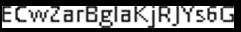

# Ledger Tesseract training application

Fork of the boilerplate app used to train the tesseract model for OCR on Nano S Plus and Nano X devices screens.

The goal is not to train Tesseract from scratch but use Nano X (or Nano S Plus) screenshots to fine tune the english model in order to better perform OCR on these screens.

## Training the model

```shell
#Install tesseract
sudo apt install tesseract-ocr

# Pull app-builder docker image and build app for Nano X (same screens as Nano S Plus)
sudo docker pull ghcr.io/ledgerhq/ledger-app-builder/ledger-app-builder-lite:latest
sudo docker run --rm -ti --user "$(id -u):$(id -g)" --privileged -v "$(realpath .):/app" ghcr.io/ledgerhq/ledger-app-builder/ledger-app-builder-lite:latest bash -c "BOLOS_SDK=/opt/nanox-secure-sdk make"

# Execute the following make target that performs the following actions : 
#     * Prepare language data for tesseract (unichar sets and other training source data) 
#     * Get latest 'best trained' english model
#     * Generate pre-processed training snapshots and then groundtruth data (single line text images + detected text)
#       based on the snapshots.
make prepare-data
```

Now comes the painful step.

For every text line `.tif` image in the ground truth directory (`data/nano-font-ocr-ground-truth`) the detected text in every corresponding `.gt.txt` needs to be **checked** and **manually fixed** so that it is error free when launching the training process.

For instance, take this text line image (let's say it's called `data/nano-font-ocr-ground-truth/00006_processed-002.exp0.tif`)



Every error has to be fixed in the ground truth text file (that would be `data/nano-font-ocr-ground-truth/00006_processed-002.exp0.gt.txt`)

If the content of the `.gt.txt` is **ECwZar8gIaKjR]¥s6G**, it has to be changed so it matches the string of the `.tif`, which in this case is **ECwZarBglaKjRJYs6G**.
### Corrected ground truth text

When doing `make prepare-data`, ground truth text provided in `corrected-ground-truth` is copied to `data/nano-font-ocr-ground-truth` and overwrite the default generated text that is full of errors.

These text files have been reviewed and should be error free if there are no significant changes in the way strings are displayed on the device's screen compared to when they were prepared.

If there are no mistakes in the `.gt.txt` files corresponding to the `.tif` training images. You can launch the training :

```shell
# Run training
make train-nano-ocr
```

### Doing manual text corrections

If the provided corrected groundtruth text is not matching the generated `.tif` images (for instance if the app screens have significantly changed because of modifications in the SDK or the device OS), you have to manually fix every corresponding `.gt.txt`. 

Then you can launch the training :

```shell
# Run training
make train-nano-ocr
```

## Using the trained model

After the training is complete, a model file will be available for use with Tesseract. By default it is `nano-font-ocr.traineddata` located in the `data` directory of `app-tess-train`.
### With Tesseract command line

On Linux, you can copy `nano-font-ocr.traineddata` file in the tessdata directory : 

```shell
sudo cp data/nano-font-ocr.traineddata /usr/share/tesseract-ocr/4.00/tessdata/
```

Then you can perform OCR with the trained model using the tesseract command :

```shell
# the '-' at the end is important.
tesseract -l nano-font-ocr path/to/my/image -
```

### With Pytesseract

You can use the trained model with pytesseract in the following way :

```python
import pytesseract

# Set the path to the nano-font-ocr.traineddata directory
tessdata_dir_config = "--tessdata-dir /path/to/nano-font-ocr.traineddata"

# Load the custom traineddata file
image_path = '/path/to/image.png'

# Perform OCR on the image with the trained model.
pytesseract.image_to_data(image_path, lang="nano-font-ocr", config=tessdata_dir_config)
```
